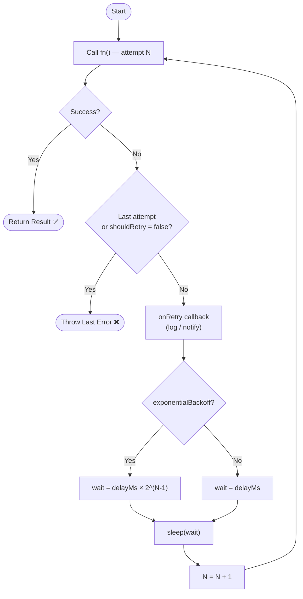
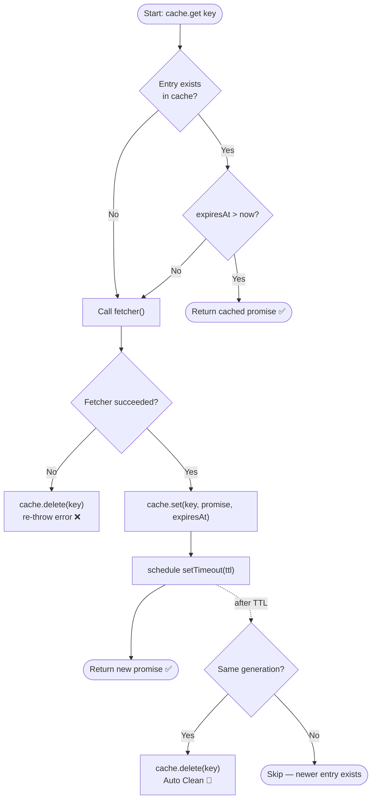
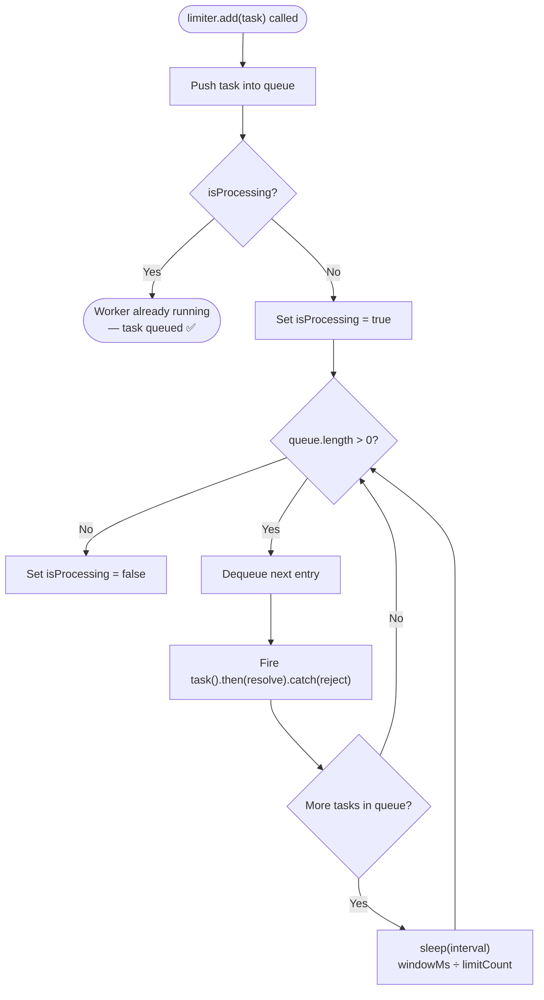

# Task 11 – TypeScript Functions

A collection of TypeScript exercises and patterns covering core language features and real-world utilities.

---

## Table of Contents

1. [Retry Mechanism for Async Functions](#1-retry-mechanism-for-async-functions)
2. [Promise-Based Cache with Expiration](#2-promise-based-cache-with-expiration)
3. [Rate Limiting API](#3-rate-limiting-api)

---

## 1. Retry Mechanism for Async Functions

**File:** [`task11/retry-mechanism.ts`](./task11/retry-mechanism.ts)

### Overview

Implements a robust retry wrapper for any asynchronous function. When an async call fails, the mechanism automatically re-invokes it up to a configurable number of times, with optional delays and exponential back-off.

### Key Components

| Component | Type | Description |
|---|---|---|
| `RetryOptions` | Interface | Configuration options for retry behaviour |
| `RetryHandler` | Class | Encapsulates retry logic; call `.execute(fn)` |
| `withRetry` | Function | Lightweight functional wrapper around `RetryHandler` |
| `sleep` | Helper | Internal promise-based delay utility |

### `RetryOptions` Interface

```ts
interface RetryOptions {
  maxAttempts?:       number;                                        // default: 3
  delayMs?:           number;                                        // default: 1000
  exponentialBackoff?: boolean;                                      // default: false
  shouldRetry?:       (error: unknown, attempt: number) => boolean;  // default: always true
  onRetry?:           (error: unknown, attempt: number) => void;     // default: no-op
}
```

### Usage Examples

#### Class-based

```ts
const handler = new RetryHandler({
  maxAttempts: 5,
  delayMs: 200,
  exponentialBackoff: true,
  onRetry: (err, attempt) =>
    console.log(`Attempt ${attempt} failed: ${(err as Error).message}`),
});

const result = await handler.execute(() => fetchData(url));
```

#### Functional wrapper

```ts
const data = await withRetry(() => fetchData(url), {
  maxAttempts: 3,
  delayMs: 500,
});
```

#### Custom retry predicate

```ts
const data = await withRetry(() => fetchData(url), {
  maxAttempts: 4,
  shouldRetry: (error) => error instanceof NetworkError,
});
```

### How It Works



### Running the File

```bash
# Compile
npx tsc task11/retry-mechanism.ts --target ES2020 --module commonjs --outDir dist

# Run
node dist/task11/retry-mechanism.js
```

---

## 2. Promise-Based Cache with Expiration

**File:** [`task11/async-cache.ts`](./task11/async-cache.ts)

### Overview

Implements an in-memory, promise-based cache where every entry carries a **TTL (Time-To-Live)**. Expired entries are evicted automatically via `setTimeout`, and failed fetches are never stored. The cache integrates seamlessly with the `RetryHandler` from Task 1 to provide both resilience and performance.

### Key Components

| Component | Type | Description |
|---|---|---|
| `CacheItem<T>` | Interface | Internal entry — stores the promise and its expiry timestamp |
| `AsyncCache` | Class | Core cache class with `get`, `invalidate`, and `clear` |
| `getReliableData` | Function | Demo combining `AsyncCache` + `RetryHandler` |

### `CacheItem<T>` Interface

```ts
interface CacheItem<T> {
  promise:   Promise<T>; // in-flight or resolved promise
  expiresAt: number;     // Date.now() + ttl
}
```

### `AsyncCache` API

```ts
// Retrieve from cache or fetch fresh data
cache.get<T>(key: string, fetcher: () => Promise<T>, ttl?: number): Promise<T>

// Manually remove a single entry
cache.invalidate(key: string): void

// Wipe the entire cache
cache.clear(): void

// Number of currently stored entries
cache.size: number
```

### Usage Examples

#### Basic cache (hit / miss)

```ts
const cache = new AsyncCache();

// MISS → calls fetcher, stores result for 5 s
const user = await cache.get("user_1", () => fetchUser(1), 5_000);

// HIT  → returns cached promise immediately
const same = await cache.get("user_1", () => fetchUser(1), 5_000);
```

#### Combined with RetryHandler

```ts
const cache   = new AsyncCache();
const retryer = new RetryHandler({ maxAttempts: 5, delayMs: 200, exponentialBackoff: true });

const profile = await cache.get(
  "profile_data",
  () => retryer.execute(() => fetch("/api/profile").then(r => r.json())),
  300_000   // cache for 5 minutes
);
```

> The `RetryHandler` lives **inside** the fetcher, so only one in-flight request exists per key even under concurrent callers.

#### Manual invalidation

```ts
cache.invalidate("user_1"); // force next call to re-fetch
cache.clear();              // wipe everything
```

### How It Works



### Running the File

```bash
# Compile
npx tsc task11/async-cache.ts --target ES2020 --module commonjs --outDir dist

# Run
node dist/task11/async-cache.js
```

---

## 3. Rate Limiting API

**File:** [`task11/rate-limiter.ts`](./task11/rate-limiter.ts)

### Overview

Implements a queue-based rate limiter that ensures at most `limitCount` tasks **start** within every `windowMs` milliseconds. Incoming tasks beyond the limit are queued and drained one-by-one with an evenly spaced `interval = windowMs / limitCount` between each, preventing burst overload on downstream services (APIs, SMS gateways, etc.).

### Key Components

| Component | Type | Description |
|---|---|---|
| `Task<T>` | Type alias | Zero-arg fn returning `Promise<T>` |
| `QueueEntry<T>` | Interface | Holds a task plus its resolve/reject handles |
| `RateLimiter` | Class | Core limiter — `add()`, `pending`, `clear()` |

### Constructor

```ts
new RateLimiter(
  limitCount: number,  // tasks allowed per window
  windowMs:   number   // window size in milliseconds
)
// inter-task interval = windowMs / limitCount
```

### `RateLimiter` API

```ts
// Enqueue a task — returns a Promise that resolves when the task runs
limiter.add<T>(task: Task<T>): Promise<T>

// Tasks currently waiting in the queue
limiter.pending: number

// Reject & discard all queued (not yet started) tasks
limiter.clear(): void
```

### Usage Examples

#### SMS gateway (2 req / sec)

```ts
const smsLimiter = new RateLimiter(2, 1_000);

const phones = ["010...", "011...", "012...", "015..."];

await Promise.all(
  phones.map((phone) =>
    smsLimiter.add(() => sendSMS(phone))
  )
);
```

#### API calls with error handling

```ts
const apiLimiter = new RateLimiter(3, 2_000); // 3 req per 2 sec

await Promise.allSettled(
  ids.map((id) =>
    apiLimiter
      .add(() => callApi(id))
      .then((r) => console.log("OK:", r))
      .catch((e) => console.error("ERR:", e.message))
  )
);
```

#### Clear the queue mid-flight

```ts
const limiter = new RateLimiter(1, 2_000);

// Enqueue 5 tasks, then abort remaining ones after 100 ms
setTimeout(() => limiter.clear(), 100);
```

### How It Works



> **Key design decisions**
> - Tasks are fired without `await` so they run concurrently if they resolve quickly, but the *start* of each is spaced by `interval`.
> - `clear()` rejects all pending (not yet started) entries — already-fired tasks complete normally.

### Running the File

```bash
# Compile
npx tsc task11/rate-limiter.ts --target ES2020 --module commonjs --outDir dist

# Run
node dist/task11/rate-limiter.js
```

---